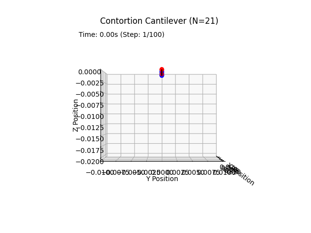
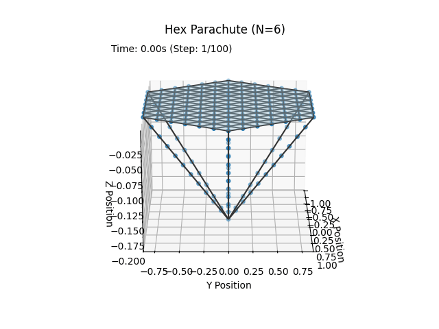
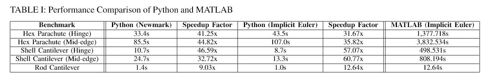

# dismech-python
|  |  |
|:--:|:--:|
| Manually contorted 3D discrete rod. |  Hex parachute falling with drag. |
| Energy-conserving Newmark-beta ($\gamma=0.5$ $\beta=0.25$) integration. |  Energy-conserving implicit midpoint integration. |


A discrete differential geometry deformable structure simulator based on [Dismech](https://github.com/StructuresComp/dismech-rods).

## Setup

To install this Python library within a new [virtual environment](https://docs.python.org/3/library/venv.html) execute the following bash commands. If you wish to use your own package manager (conda), only execute the commands after the comment. 

```bash
python -m venv .venv
source .venv/bin/activate           #.venv/Script/activate for Windows

# after virtual environment setup
pip install -r requirements.txt
pip install -e .                    # Editable installation for development
```

## Features

- [x] 3D [discrete elastic rod](https://www.cs.columbia.edu/cg/pdfs/143-rods.pdf) stretching, bending and twisting.
- [x] 3D discrete elastic shell hinge and mid-edge bending.
- [x] Pytest numerical validation suite (compared against [Dismech Matlab](https://github.com/StructuresComp/dismech-matlab)).
- [x] [Dismech Matlab](https://github.com/StructuresComp/dismech-matlab) compatabile input format.
- [x] Implicit integration schemes (Euler and Newmark-beta).
- [x] Dense and sparse ([PyPardiso](https://pypi.org/project/pypardiso/)) solvers.
- [x] Significant speedup for dynamic simulations.



## Experiments

To run example experiments, please run the python notebooks located in experiments. They rely on local paths to tests/resources, so they will break if moved.

## TODO

- [ ] [IMC](https://arxiv.org/abs/2205.10309) rod contact and friction modeling.
- [ ] Shell contact and friction modeling.
- [ ] Sphinx documentation.
- [ ] Slinky NN demonstration.

